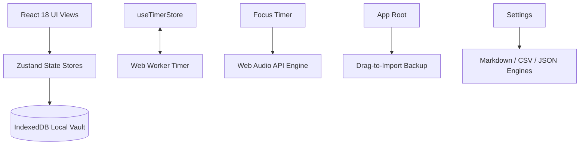

# Planr — Daily Planner & Focus Timer

> *"Simplicity is the ultimate sophistication."*

**Planr** is a distraction-free daily planner with built-in ambient sounds and private local storage. No subscriptions, no ads, and no sign-up required. Built with **React 18**, **TypeScript**, **Tailwind CSS**, and **IndexedDB**.

---

## 🏗️ System Architecture



---

## ✨ Features

- **🌅 Daily Overview & Focus Goal**:
  - Dynamic localized greeting and date based on user locale.
  - Daily focus goal editor with shareable quote card generator.
  - Interactive SVG circular balance ring tracking completion rate with a celebration state when reaching 100%.
  - Priority task queue with 1-click **"☀️ Plan for Today"** action.

- **✅ Task Management & Subtasks**:
  - Full CRUD operations synced directly to IndexedDB.
  - Filter tabs: *All Tasks, Today, Upcoming, High Priority, Work, Personal, Mindful, Completed*.
  - React 18 `useDeferredValue` search and custom animated `<Select />` dropdown sorting.
  - Collapsible subtasks checklist with individual toggles.
  - Toast notifications with instant **Undo** capability.

- **⏰ Reminders with Custom TimePicker**:
  - Custom Stone & Sage `<TimePicker />` component with 12h (AM/PM) and 24h military time support.
  - Accessible `<ToggleSwitch />` controls for audio chimes.
  - Recurrence options: *Daily, Weekdays, Weekly, Once*.

- **🧘 Focus Timer & Procedural Audio**:
  - Pomodoro timer with customizable presets (25m, 50m, 5m break, 15m break).
  - Background Web Worker sync preventing tab sleep drift.
  - Dedicated **Full Screen Mode** (toggleable via the `F` key).
  - Web Audio synthesizers generating **Pink Noise, Rain, Forest Breeze, and Harmonic Drones** with Solfeggio tuning (432Hz, 528Hz, 639Hz).

- **⌨️ Customizable Keyboard Shortcuts**:
  - Built-in interactive shortcut remapper inside the keyboard shortcuts dialog.
  - Remap any shortcut key for task creation, full screen toggle, and view navigation.

- **💾 100% Private On-Device Storage**:
  - All data stored in local IndexedDB. Works completely offline.
  - Export backups as JSON, Markdown (Obsidian-ready), or CSV.
  - Drag-and-drop any `.json` backup file onto the browser window to restore.

---

## 🛠️ Development & Testing

```bash
# Install dependencies
npm install

# Start local development server
npm run dev

# Run TypeScript compilation check
npm run typecheck

# Run test suite
npm test

# Build production bundle
npm run build
```
