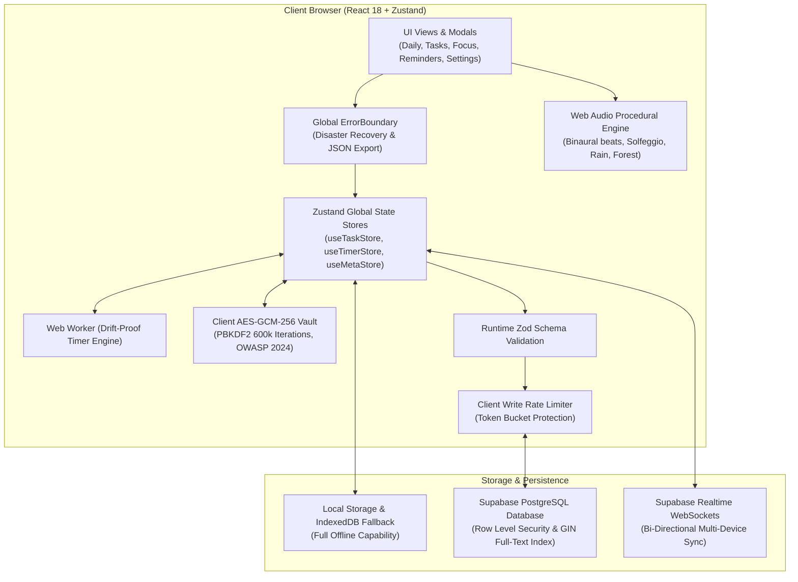

# Planr — Daily Planner & Focus Timer

> *"Simplicity is the ultimate sophistication."*

**Planr** is a calm, distraction-free productivity system engineered with private local-first storage, ambient soundscapes, drift-proof Pomodoro timers, and seamless cloud synchronization. Built with **React 18**, **TypeScript**, **Tailwind CSS**, **Zustand**, and **Supabase (PostgreSQL with RLS)**.

---

## 🏗️ System Architecture



---

## ✨ Core Pillars & Capabilities

### 1. 🌅 Daily Overview & Intention Setting
- Dynamic localized greeting and date formatting based on user locale.
- Daily intention editor with shareable quote cards.
- Interactive SVG circular balance ring tracking completion rate with a celebration state when reaching 100%.
- Overdue tasks banner with 1-click **"☀️ Reschedule for Today"** action.

### 2. ✅ Task Management & Subtasks
- Multi-view presentation: **List View**, **Kanban Board**, and **Calendar (Month Grid & Mobile Agenda)**.
- Filter tabs: *All Tasks, Today, Upcoming, High Priority, Work, Personal, Mindful, Completed*.
- React 18 `useDeferredValue` search and custom animated `<Select />` dropdown sorting.
- Collapsible subtasks checklist with individual progress tracking.
- Distributed tombstone tracking preventing deleted tasks from resurrecting during Realtime hydration.

### 3. ⏰ Reminders & Custom TimePicker
- Custom Stone & Sage `<TimePicker />` component with 12h (AM/PM) and 24h military time support.
- Accessible `<ToggleSwitch />` controls for audio chimes.
- Recurrence options: *Daily, Weekdays, Weekly, Once*.

### 4. 🧘 Focus Timer & Procedural Audio
- Pomodoro countdown with customizable presets (25m, 50m, 5m break, 15m break).
- **Background Web Worker sync** preventing browser tab sleep drift.
- **Screen Wake Lock API** integration keeping screens awake during focus sessions.
- **WCAG screen reader live region** (`aria-live="polite"`) announcing countdown milestones.
- Web Audio synthesizers generating **Pink Noise, Rain, Forest Breeze, and Harmonic Drones** with Solfeggio tuning (432Hz, 528Hz, 639Hz).

### 5. 🔐 Zero-Knowledge Secret Vault
- End-to-end client-side encryption using the browser Web Crypto API:
  - Algorithm: `AES-GCM-256`.
  - Key Derivation: `PBKDF2` with **600,000 iterations** and `SHA-256`.
  - Chunked base64 serialization supporting large payloads (>64KB) safely.
  - Auto-lock timer clearing secret keys from memory after 15 minutes of inactivity.

### 6. 💾 Local-First Resilience & GDPR Compliance
- All data operable completely offline.
- Data export in JSON, Markdown (Obsidian-ready), or CSV formats.
- Drag-and-drop any `.json` backup file onto the browser window to restore immediately.
- Right to Erasure: Database cascading deletes permanently remove all records upon account deletion.

---

## 🛠️ Development & Local Setup

### Prerequisites
- Node.js 20+
- Docker & Docker Compose (optional, for local Postgres)

### Quick Start
```bash
# 1. Install dependencies
npm install

# 2. Configure environment (or use offline local fallback)
cp .env.example .env

# 3. Start development server
npm run dev
```

### Local Hermetic Database (Docker)
```bash
# Start local PostgreSQL database with initial schema seed
docker compose up -d

# Verify database health
docker compose ps
```

### Supabase CLI Local Orchestration
```bash
# Start Supabase local emulator suite
npx supabase start

# Reset local database with fresh migrations
npx supabase db reset
```

---

## 🧪 Testing & Validation

```bash
# Run static type checking
npm run typecheck

# Run full Vitest unit & integration test suite
npm test

# Run Playwright End-to-End browser tests
npm run test:e2e

# Build production bundle
npm run build
```

---

## 📄 License & Privacy
Planr is released under the **MIT License**. We respect your attention and privacy: zero third-party ads, zero tracking scripts, and zero subscription paywalls.
